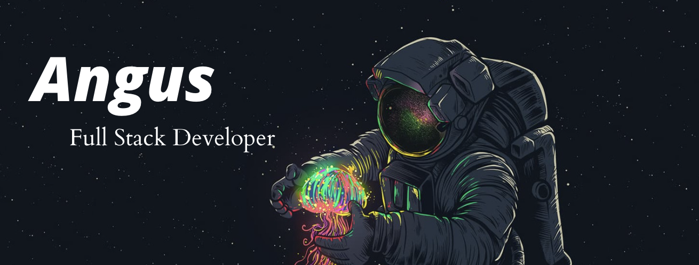

### Howdy!

---

##Welcome! I'm Angus Edwards. I hope you feel the same way about my GitHub as I do about those New Orleans Saints ⚜️ Ideal date? React Native with a mongoose. Though I'll try anything once.

#Below are some more of my favourite techs:

#When I'm not working with the above you can find me exploring my local city (currently London), or possibly somewhere more ☀️! Love photography, cooking and pretty much any sport. Thanks for looking and have a great day!

<!--

**angusedwards64/angusedwards64** is a ✨ _special_ ✨ repository because its `README.md` (this file) appears on your GitHub profile.

Here are some ideas to get you started:

- 🔭 I’m currently working on ...
- 🌱 I’m currently learning ...
- 👯 I’m looking to collaborate on ...
- 🤔 I’m looking for help with ...
- 📫 How to reach me: ...
- 😄 Pronouns: ...
- ⚡ Fun fact: ...
-->
