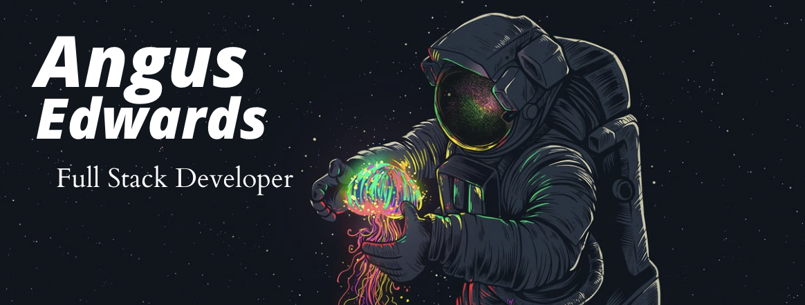

## __*Welcome!*__ 🌊

---

#### Hey there!

I'm a software engineer who loves exploring new technologies, and sharpening those I already know. Personal favourites? React Native, or a Mongo with a Mongoose 🦦 but I'll try anything once. Below are a few more of my favourite techs:

---

When I'm not working with the above you can find me exploring London, socializing with anyone who will have me, and of course watching those New Orleans Saints ⚜️. Anyway hope you like taking a look at my GitHub, and if you want to get in touch you can head to my LinkedIn!

Have a great day! 😁</strong>

<!--

**angusedwards64/angusedwards64** is a ✨ _special_ ✨ repository because its `README.md` (this file)
-->
